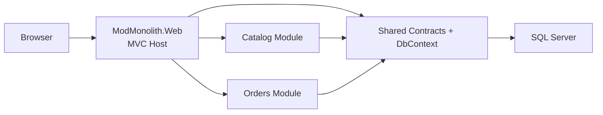

# ModMonolith Sample

This repository contains a small modular monolith sample built with ASP.NET Core MVC and SQL Server. It shows how to keep module boundaries explicit while still deploying as a single application and persisting to one relational database.

## Overview



## Structure

- `src/ModMonolith.Web`: composition root, MVC controllers, Razor views, and ASP.NET Core host
- `src/ModMonolith.Shared`: shared abstractions, contracts, and EF Core `DbContext`
- `src/ModMonolith.Modules.Catalog`: product catalog module
- `src/ModMonolith.Modules.Orders`: order management module

The host owns startup. Each module owns:

- service registration
- HTTP endpoints
- EF Core entity configuration
- seed data

The frontend is served by the same ASP.NET application through MVC controllers and Razor views. Static assets remain in `src/ModMonolith.Web/wwwroot`.

## Database

The default connection string targets a local SQL Server container on port `14333`:

```json
"ConnectionStrings": {
  "ModMonolith": "Server=localhost,14333;Database=ModMonolithSample;User Id=sa;Password=Your_password123;Encrypt=False;TrustServerCertificate=True"
}
```

Start SQL Server with Docker:

```powershell
docker compose up -d sql
```

Override the connection string when you want a different SQL Server instance:

```powershell
$env:ConnectionStrings__ModMonolith="Server=localhost,1433;Database=ModMonolithSample;User Id=sa;Password=Your_password123;TrustServerCertificate=True"
```

If you prefer LocalDB instead, point `ConnectionStrings__ModMonolith` to your LocalDB instance.

## Run

```powershell
$env:DOTNET_CLI_HOME="D:\Projects\ModMonolith\.dotnet"
dotnet restore
dotnet run --project .\src\ModMonolith.Web
```

In Visual Studio, start the `https` profile. The browser launch is configured to open `/`.

## Sample endpoints

- `GET /`
- `GET /api/system`
- `GET /api/catalog/products`
- `POST /api/catalog/products`
- `GET /api/orders/orders`
- `POST /api/orders/orders`

Example order payload:

```json
{
  "lines": [
    {
      "productId": "PUT-A-REAL-PRODUCT-ID-HERE",
      "quantity": 2
    }
  ]
}
```

## Architecture note

This is intentionally small. The important demonstration is the shape:

- the API project composes modules but does not own their business behavior
- modules communicate through explicit contracts and DI, not through controllers full of cross-module knowledge
- the user-facing page follows MVC with controllers, view models, and Razor views
- one process and one database keep operations simple, but the code remains partitioned by module
