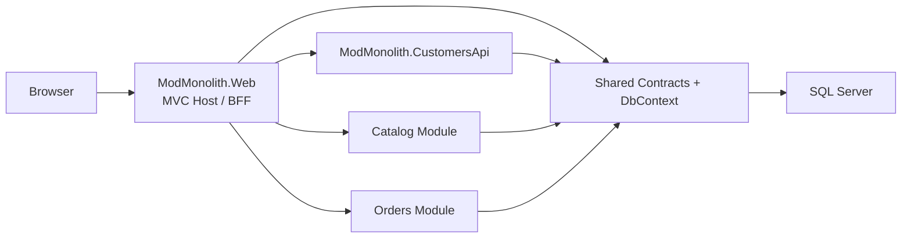

# ModMonolith Sample

This repository contains a small modular monolith tutorial sample built with ASP.NET Core MVC and SQL Server. The root of the repository is the current recommended stage: `Customers` has been moved into its own ASP.NET Core API host, while `Catalog` and `Orders` still run inside `ModMonolith.Web`.

## Overview



## Structure

- `src/ModMonolith.Web`: composition root, MVC controllers, Razor views, and ASP.NET Core host
- `src/ModMonolith.CustomersApi`: dedicated ASP.NET Core API host for the `Customers` capability
- `src/ModMonolith.Modules.Customers`: customer management module
- `src/ModMonolith.Shared`: shared abstractions, contracts, and EF Core `DbContext`
- `src/ModMonolith.Modules.Catalog`: product catalog module
- `src/ModMonolith.Modules.Orders`: order management module
- `snapshots/01-before-extraction`: earlier pre-extraction tutorial snapshot
- `snapshots/02-pre-service-refactor`: later modular-monolith snapshot before the customer API split
- `docs/comparison-01-vs-02.md`: summary of the source-level delta between the two archived snapshots

## Tutorial flow

If you are reading this repository as a tutorial, use this order:

1. Start at the root application.
2. Read the architecture docs in `docs/`.
3. Use `snapshots/01-before-extraction` and `snapshots/02-pre-service-refactor` as reference checkpoints, not as the main entry point.

The remaining in-process modules own:

- service registration
- HTTP endpoints
- EF Core entity configuration
- seed data

`Customers` is now represented by two separate things:

- `src/ModMonolith.Modules.Customers`: the customer business module and endpoint mapping
- `src/ModMonolith.CustomersApi`: the dedicated API host that runs that module
- `ModMonolith.Web` calls that API through an HTTP-backed `ICustomerDirectory`
- `Orders` still depends on `ICustomerDirectory`, but the transport is now network-based rather than in-process

The distinction matters:

- the module is the business boundary
- the API host is the runtime and deployment boundary
- the customer API owns its own database by default in this snapshot

The frontend is still served by `ModMonolith.Web` through MVC controllers and Razor views. Static assets remain in `src/ModMonolith.Web/wwwroot`.

## Database

The default connection strings target a local SQL Server container on port `14333`:

```json
ModMonolith.Web:
"ConnectionStrings": {
  "ModMonolith": "Server=localhost,14333;Database=ModMonolithSample;User Id=sa;Password=Your_password123;Encrypt=False;TrustServerCertificate=True"
}

ModMonolith.CustomersApi:
"ConnectionStrings": {
  "ModMonolith": "Server=localhost,14333;Database=ModMonolithCustomers;User Id=sa;Password=Your_password123;Encrypt=False;TrustServerCertificate=True"
}
```

Start SQL Server with Docker:

```powershell
docker compose up -d sql
```

Override the connection string when you want a different SQL Server instance:

```powershell
$env:ConnectionStrings__ModMonolith="Server=localhost,1433;Database=ModMonolithSample;User Id=sa;Password=Your_password123;TrustServerCertificate=True"
```

If you prefer LocalDB instead, point `ConnectionStrings__ModMonolith` to your LocalDB instance.
If you override the customer API separately, keep it pointed at its own database name rather than the shared web-host database.

## Run

```powershell
$env:DOTNET_CLI_HOME="D:\Projects\ModMonolith\.dotnet"
dotnet restore
dotnet run --project .\src\ModMonolith.CustomersApi
dotnet run --project .\src\ModMonolith.Web
```

Run the customers API first so `ModMonolith.Web` can resolve customer lookups and create orders.

Default URLs:

- `ModMonolith.CustomersApi`: `http://localhost:5241`
- `ModMonolith.Web`: `http://localhost:5145`

`ModMonolith.Web` reads the customer API base URL from:

```json
"Services": {
  "Customers": {
    "BaseUrl": "http://localhost:5241"
  }
}
```

In Visual Studio, start both service hosts or use multiple startup projects.

In Development, the sample will recreate the database automatically if the schema no longer matches the current module model. This is intentional for a demo app that uses `EnsureCreated` rather than migrations.
For `3`, that is only safe because `ModMonolith.CustomersApi` uses `ModMonolithCustomers` by default instead of sharing the `ModMonolithSample` database with `ModMonolith.Web`.

## Sample endpoints

- `GET /`
- `GET /api/system`
- `GET http://localhost:5241/api/customers/customers`
- `POST http://localhost:5241/api/customers/customers`
- `GET /api/catalog/products`
- `POST /api/catalog/products`
- `GET /api/orders/orders`
- `POST /api/orders/orders`

Example order payload:

```json
{
  "customerId": "PUT-A-REAL-CUSTOMER-ID-HERE",
  "lines": [
    {
      "productId": "PUT-A-REAL-PRODUCT-ID-HERE",
      "quantity": 2
    }
  ]
}
```

## Architecture note

This is intentionally small. The important demonstration is the shape:

- the web host composes local modules but does not own their business behavior
- `Customers` has moved to a dedicated API host without changing the `ICustomerDirectory` contract shape used by the rest of the app
- modules and services communicate through explicit contracts and DI-backed integrations, not through controllers full of cross-module knowledge
- the user-facing page follows MVC with controllers, view models, and Razor views
- the repository now demonstrates the transition point between a modular monolith and independently deployable services
