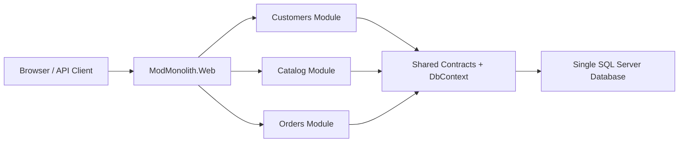
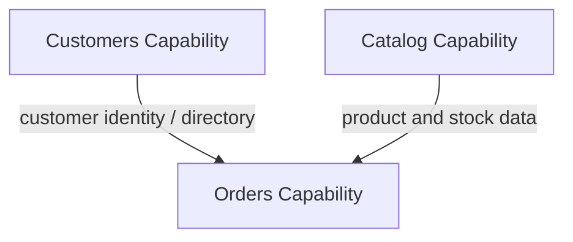
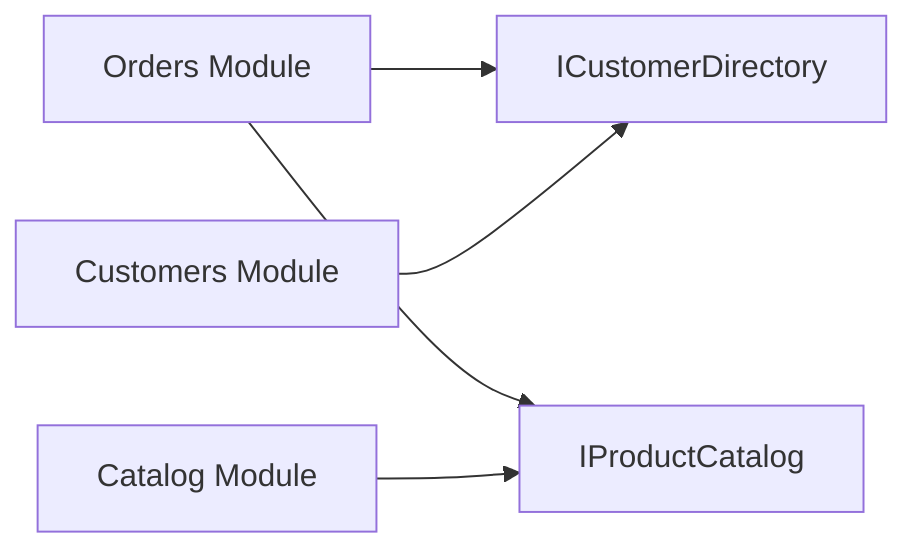
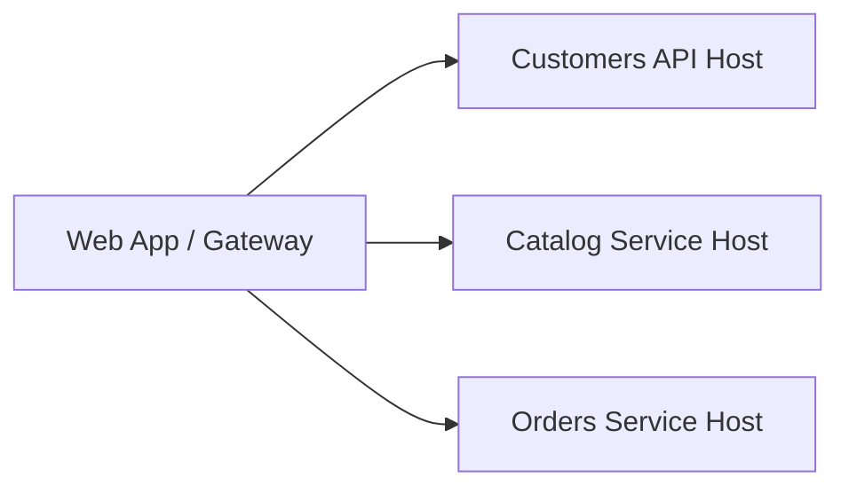
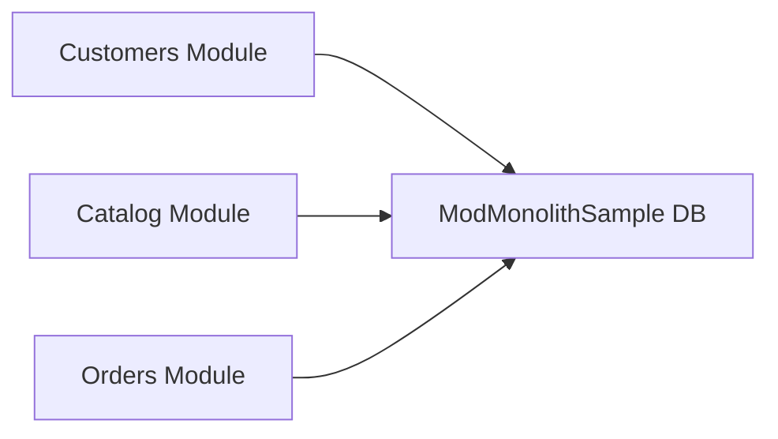
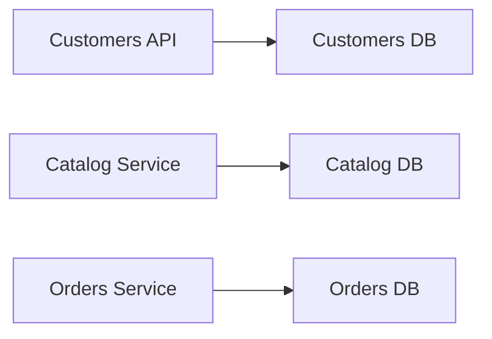
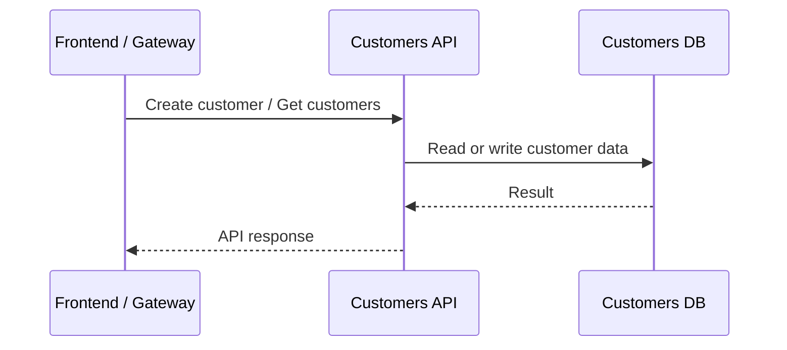
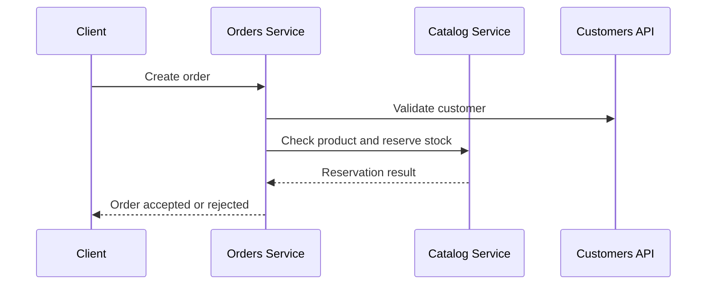
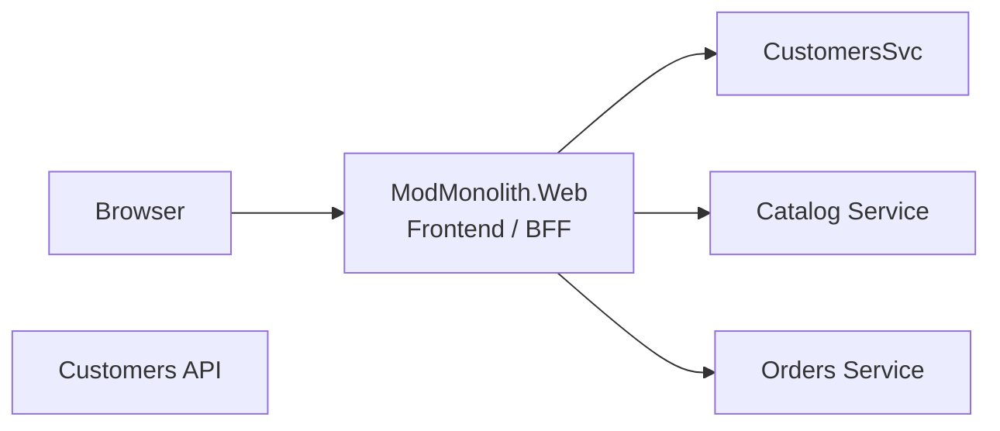

# Evolving This Modular Monolith Into Services

This document explains how the current solution could evolve into independently deployable services later.

In snapshot `3`, the first step of that evolution has already been demonstrated: `Customers` now runs in its own API host, `ModMonolith.CustomersApi`, while `ModMonolith.Web` talks to it through an HTTP-backed `ICustomerDirectory`.
The snapshot also gives `Customers` its own database by default. That is important because a dedicated host should not try to evolve one slice of a shared `EnsureCreated` schema in place.

The important point is that the current modular structure is the starting point. You do not begin from scratch. You use the existing module boundaries as candidates for extraction.

## Current shape

Right now the system is one deployable application.

This gives you:

- one build
- one deployment
- one runtime
- one database

## What "evolve into services" means

It does not mean flipping a switch.

It means taking one internal module at a time and moving it from:

- in-process calls
- shared code
- shared database

toward:

- network calls
- service-owned codebase or deployable host
- service-owned data

The module boundary is the design boundary. Service extraction is the runtime boundary added later.

## Candidate services in this sample

If this solution grew, the most natural service candidates would be:

- `Customers`
- `Catalog`
- `Orders`

Those are already separate business capabilities.

`Orders` is the most coordination-heavy module, because it depends on information from other modules. That makes it a good example of why modular boundaries matter before services exist.

## A realistic extraction order

A sensible evolution path would usually look like this:

1. Strengthen contracts inside the monolith.
2. Reduce direct shared-data assumptions.
3. Extract the least entangled module first.
4. Introduce service-to-service communication.
5. Split databases only when module ownership is already clear.

For this sample, a plausible order would be:

1. `Customers`
2. `Catalog`
3. `Orders`

Why this order:

- `Customers` is relatively self-contained
- `Catalog` is also fairly self-contained, but stock rules affect ordering
- `Orders` depends on the others and is therefore the most expensive to extract first

## Stage 1: Stay in one solution, strengthen boundaries

Before creating separate deployables, improve the contracts while still inside the monolith.

Examples in this repository:

- keep `Orders` talking to `Catalog` through `IProductCatalog`
- keep customer operations behind `ICustomerDirectory`
- avoid letting `Orders` reach into `Customers` or `Catalog` entities directly

This is the preparation step.

If you cannot describe module interaction clearly in-process, you are not ready to put a network between them.

## Stage 2: Split the hosts, keep the code

The first runtime change is often to create separate ASP.NET hosts while reusing most of the existing module code.

For example:

- `ModMonolith.CustomersApi`
- `ModMonolith.CatalogService`
- `ModMonolith.OrdersService`

At this stage, the module project may still exist, but each service host references only the module it owns plus shared contract packages.

The current `ModMonolith.Web` would either:

- remain as the frontend host and call the services, or
- be replaced by a dedicated frontend plus API gateway arrangement

## Stage 3: Separate the databases

True service independence usually requires data ownership to become physical, not just logical.

Today:

Later:

This is the point where:

- joins across modules disappear
- cross-service data becomes API-driven or event-driven
- reporting may need a separate read model

## How the new `Customers` module would evolve

The `Customers` module is a good example because it is relatively simple and has clear ownership.

### Current state

- customer records live in the shared SQL Server database
- customer functionality is exposed through the monolith
- MVC pages and APIs use `ICustomerDirectory`

### Service extraction target

Later, `Customers` could become:

- its own ASP.NET Core service host
- its own database
- the source of truth for customer lookup and registration

### What changes in code

Today:

- `ModMonolith.Web` can inject `ICustomerDirectory`

Later:

- the frontend or `Orders` service would call the Customers API
- `ICustomerDirectory` would likely become an HTTP client abstraction rather than an in-process service abstraction

That is the key pattern: keep the contract idea, change the transport.

## How `Orders` changes when services appear

`Orders` is where the architecture becomes more interesting.

Today, `Orders` can:

- ask for product data in-process
- reserve stock in-process

Later, that becomes a distributed workflow.

This introduces new concerns:

- retries
- timeouts
- partial failure
- eventual consistency

That is exactly why keeping the system modular first is valuable. You delay distributed systems complexity until it is actually justified.

## Shared project changes over time

The current `ModMonolith.Shared` project mixes:

- cross-module contracts
- abstractions
- shared persistence

If the system becomes services, that project should be split.

A more service-friendly future shape would be:

- `ModMonolith.Contracts.Customers`
- `ModMonolith.Contracts.Catalog`
- `ModMonolith.Contracts.Orders`
- host-specific infrastructure in each service

What should not remain shared across services:

- one shared EF Core `DbContext`
- one shared persistence model
- broad shared infrastructure that couples deployments together

## What probably stays in the web host

If you keep `ModMonolith.Web` after service extraction, it would most likely become one of these:

- an MVC frontend host that calls backend services
- a backend-for-frontend
- a gateway/composition layer

That is a very different role from the current monolith host, even if the project name stays the same.

## What you would add before real extraction

Before extracting a module into a separate service, you would normally add:

- module-specific integration tests
- explicit request/response contracts
- logging and tracing around module boundaries
- idempotency rules for operations like stock reservation
- migrations instead of `EnsureCreated`
- clearer ownership of data and transactions

This sample intentionally does not go that far, because it is demonstrating the architecture shape, not production-hardening every path.

## Practical migration path for this repository

If you wanted to evolve this repository incrementally, a practical path would be:

1. Keep `Customers`, `Catalog`, and `Orders` as internal modules.
2. Move shared persistence concerns out of `ModMonolith.Shared` and into module-owned infrastructure.
3. Introduce EF Core migrations.
4. Make all cross-module interaction go through narrow interfaces only.
5. Create a dedicated `Customers` service host first.
6. Update `ModMonolith.Web` to call the Customers API instead of injecting `ICustomerDirectory` directly.
7. Repeat for `Catalog`.
8. Rework `Orders` last, once the supporting services and contracts are stable.

## Summary

This solution is already on the first half of the path:

- modules exist
- ownership exists
- contracts exist
- deployment is still monolithic

The later service version would keep the business boundaries but change:

- transport: from in-process calls to HTTP or messaging
- data: from one database to service-owned databases
- deployment: from one artifact to several independently deployable hosts

The new `Customers` module makes that progression easier to visualize because it is a clean, self-contained capability that could be extracted with relatively low coordination cost.
