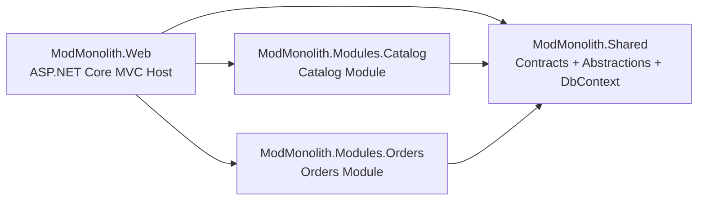
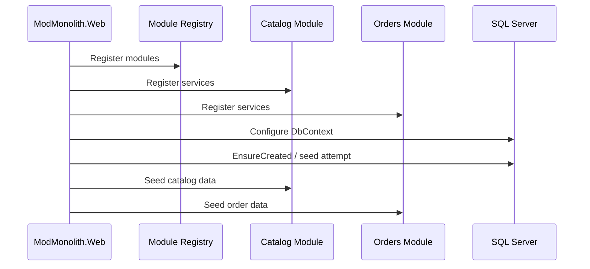
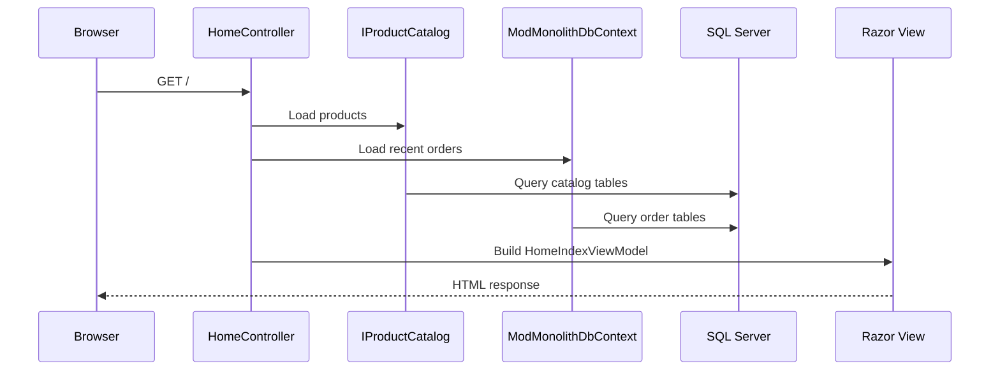
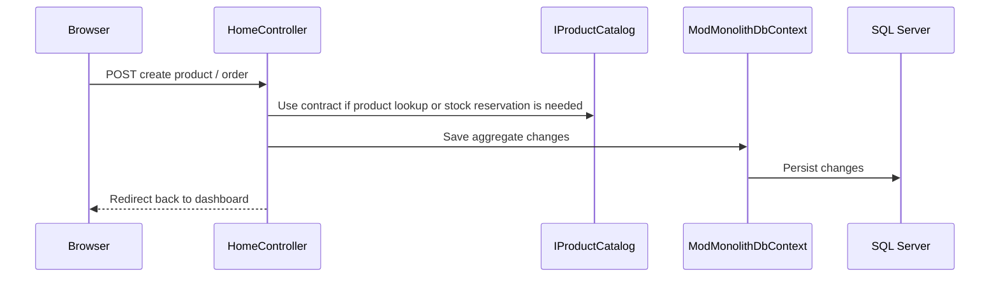
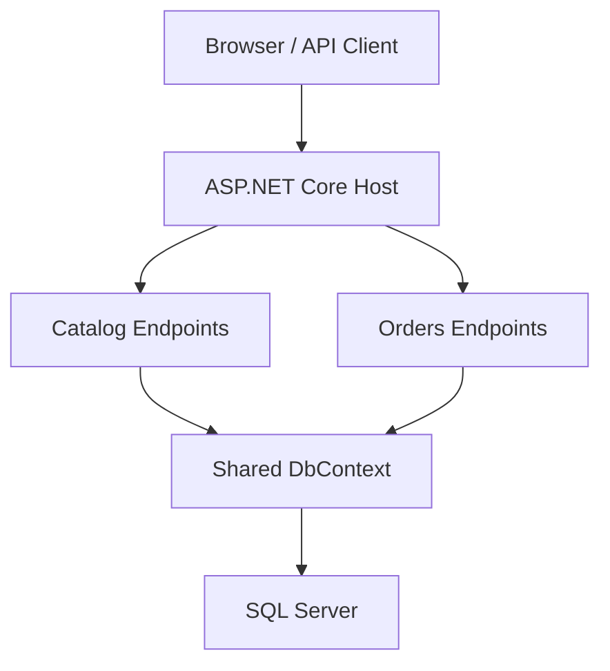
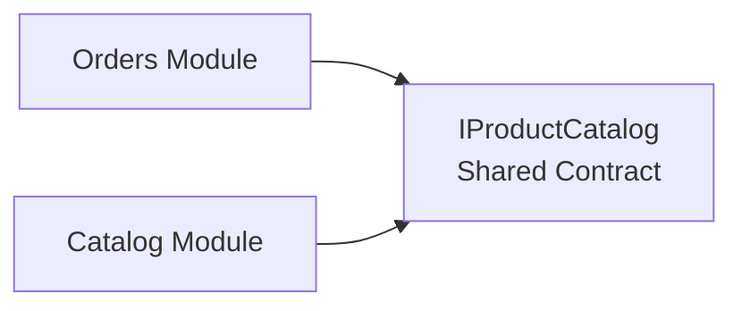
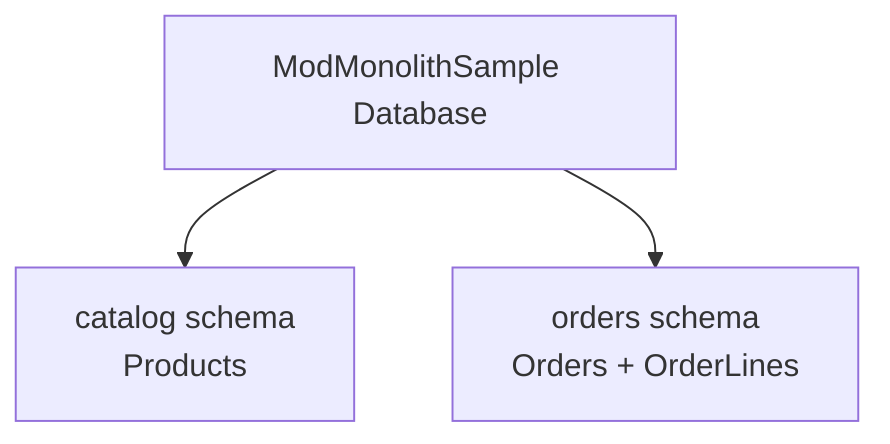
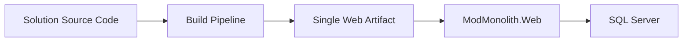

# Sample Architecture

This document explains the structure of this repository specifically, not just the general modular monolith pattern.

## Repository shape

The solution is split into one host application and several supporting projects.

## Responsibility by project

### `ModMonolith.Web`

This is the application host.

It contains:

- ASP.NET Core startup
- MVC controllers
- Razor views
- static assets
- dependency composition

It is the only project you run directly.

### `ModMonolith.Modules.Catalog`

This module owns product-related behavior.

It contains:

- product domain model
- EF Core entity configuration for catalog tables
- catalog API endpoints
- catalog seed data
- catalog service implementation

### `ModMonolith.Modules.Orders`

This module owns order-related behavior.

It contains:

- order domain model
- EF Core entity configuration for order tables
- order API endpoints
- order seed data
- order orchestration logic

### `ModMonolith.Shared`

This project holds cross-cutting building blocks that are intentionally shared.

It contains:

- module abstractions
- module registration extensions
- cross-module contracts
- shared EF Core `DbContext`

It should stay small and deliberate. If too much business logic migrates here, module boundaries weaken.

## Startup and composition

At startup, the host composes the modules into one application.

The host knows which modules exist, but the module behavior remains inside the module projects.

## MVC request flow

The user-facing page is rendered with MVC.

For form posts:

## API flow

The sample still exposes module APIs under `/api/*`.

These APIs are internal parts of the same application, not separate services.

## Module interaction

The modules should interact through explicit contracts.

In this sample, `Orders` depends on catalog information through `IProductCatalog`.

This matters because it prevents the `Orders` module from directly taking ownership of `Catalog` internals.

## Database ownership

The database is shared physically, but ownership is still modular logically.

This is an important part of the design:

- one database keeps operations simple
- separate schema areas preserve module ownership

## Deployment model

Everything is built and deployed together.

That means:

- there is one primary deployable application
- the modules are not independently deployed
- a change in one module typically results in redeploying the host

## What to notice in this sample

This sample is intentionally small, but the architectural signals are the point:

- the host composes modules, but does not own their business rules
- modules own their own domain and persistence configuration
- MVC is used for the web UI
- module APIs still exist alongside MVC
- the application is modular in code, monolithic in deployment

## Practical mental model

The simplest way to think about this repository is:

- `ModMonolith.Web` is the shell
- `Catalog` and `Orders` are internal business units
- `Shared` contains the contracts and infrastructure glue
- SQL Server is shared, but module ownership is still explicit

That is the essence of this sample.
